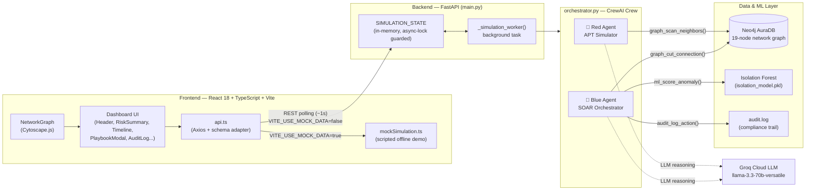
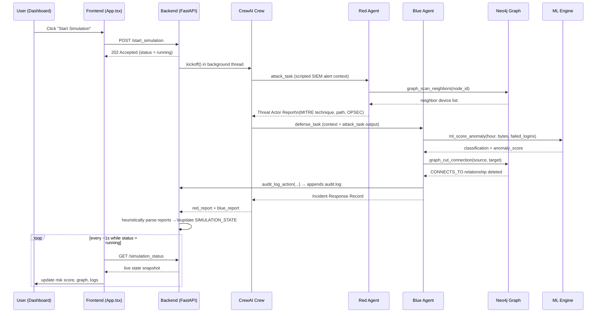
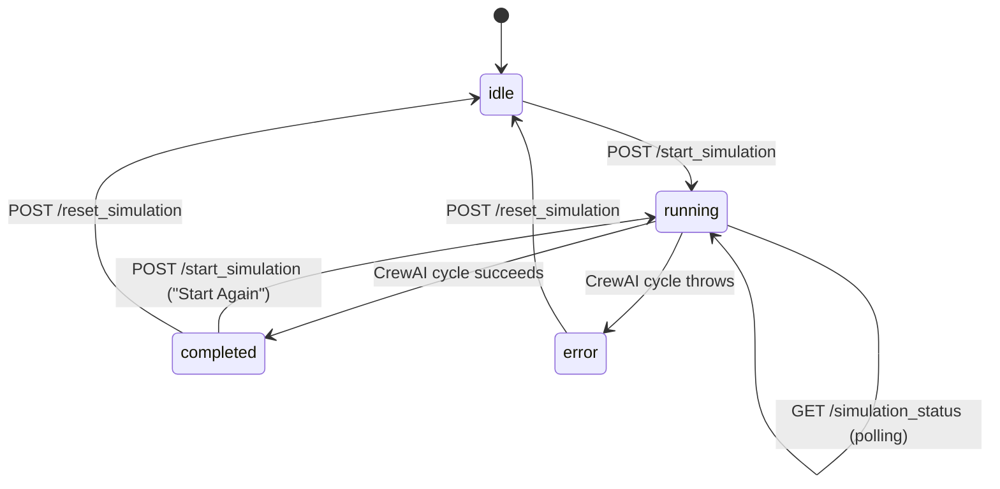

# 🛡️ Project Chronos: AI-Driven Cyber Resilience Digital Twin

**Live Dashboard:** [https://project-chronos-beryl.vercel.app](https://project-chronos-beryl.vercel.app)

**Live API Endpoint:** [https://project-chronos-cxog.onrender.com](https://project-chronos-cxog.onrender.com)

Project Chronos is an autonomous, real-time cyberattack simulation and incident-response
platform. It renders a live "digital twin" of a network, lets an AI **Red Agent** plan and
narrate a multi-stage intrusion against it, and lets an AI **Blue Agent** detect, score, and
contain that intrusion — end to end, with no hand-written playbooks dictating the outcome
step by step. Everything the agents decide is driven by an LLM (Groq's Llama 3.3 70B via
CrewAI) reasoning over real tool calls against a graph database and a trained anomaly-detection
model, and the result streams live to a React dashboard.

---

## 📚 Table of Contents

1. [Core Architecture Highlights](#-core-architecture-highlights)
2. [System Architecture Diagram](#-system-architecture-diagram)
3. [How a Simulation Cycle Works](#-how-a-simulation-cycle-works)
4. [Simulation State Machine](#-simulation-state-machine)
5. [Tech Stack](#-tech-stack)
6. [Repository Structure](#-repository-structure)
7. [API Reference](#-api-reference)
8. [Local Development Setup](#️-local-development-setup)
9. [Known Limitations & Roadmap](#-known-limitations--roadmap)
10. [References & Further Reading](#-references--further-reading)
11. [Hackathon Deployment](#-hackathon-deployment)
12. [Team](#-team)

---

## 🚀 Core Architecture Highlights

* **Multi-Agent GenAI Orchestrator:** Powered by **CrewAI** and **Groq**, using the
  `llama-3.3-70b-versatile` endpoint. A **Red Agent** ("Advanced Persistent Threat Simulator")
  plans multi-stage lateral movement by actively querying the network graph, while a
  **Blue Agent** ("Autonomous SOAR Orchestrator") mathematically verifies the threat, severs
  the attack path, and writes a compliance-grade audit trail — all classified against the
  **MITRE ATT&CK** framework.
* **Tool-Augmented Agents, Not Free-Form Chat:** Both agents only act through four explicit,
  auditable tools — `graph_scan_neighbors`, `graph_cut_connection`, `ml_score_anomaly`, and
  `audit_log_action` — so every claim in an agent's report is backed by a real function call
  and a real result, not hallucinated narrative.
* **Serverless Graph Topology:** A **Neo4j AuraDB** graph models a 19-node network (public DMZ
  + internal "government core" subnet) with realistic `CONNECTS_TO` relationships, open ports,
  operating systems, and known CVEs per device — the substrate the Red Agent scans and the Blue
  Agent surgically disconnects.
* **Machine Learning Engine:** An unsupervised **Isolation Forest** model (scikit-learn) scores
  network telemetry (`hour_of_day`, `bytes_transferred`, `failed_login_attempts`) against a
  learned baseline of normal office-hours behavior, returning both a classification
  (`ANOMALY`/`NORMAL`) and a numeric anomaly score the Blue Agent must cite before containing
  anything.
* **Modern Full-Stack Engineering:**
  * **Frontend:** React 18 + TypeScript + Vite 6 + Cytoscape.js (Deployed on Vercel)
  * **Backend:** FastAPI + CrewAI + LiteLLM (Deployed on Render)
* **Resilient by Design:** Every tool has a graceful fallback (mock topology, heuristic
  scoring, simulated containment) if Neo4j or the model file is unreachable, so the demo never
  hard-crashes mid-simulation. The frontend mirrors this with a `VITE_USE_MOCK_DATA` flag that
  runs a fully scripted simulation with zero backend dependency.
* **Local Development Independence:** The whole stack is buildable and testable on a laptop
  with no mandatory cloud dependency during development — mock mode on the frontend and the
  fallback paths on the backend keep it runnable offline.

---

## 🗺 System Architecture Diagram



---

## 🔄 How a Simulation Cycle Works



---

## 🔁 Simulation State Machine



> Note: `paused` exists as a UI-only state today — the frontend fakes it locally when you
> click **Pause**; the backend has no pause endpoint or concept of a paused cycle yet
> (see [Known Limitations](#-known-limitations--roadmap)).

---

## 🧰 Tech Stack

| Layer | Technology | Purpose |
|---|---|---|
| Frontend framework | React 18 + TypeScript | Dashboard UI |
| Build tool | Vite 6 | Dev server & bundling |
| Graph visualization | [Cytoscape.js](https://js.cytoscape.org/) (`react-cytoscapejs`) | Live network topology rendering |
| HTTP client | Axios | Frontend ↔ backend REST calls |
| Backend framework | [FastAPI](https://fastapi.tiangolo.com/) + Uvicorn | REST API + background task orchestration |
| Agent orchestration | [CrewAI](https://docs.crewai.com/) | Multi-agent task sequencing & tool calling |
| LLM provider | [Groq](https://groq.com/) (`llama-3.3-70b-versatile`) via LiteLLM | Agent reasoning |
| Graph database | [Neo4j AuraDB](https://neo4j.com/cloud/aura/) | Network topology (nodes, edges, CVEs) |
| ML engine | scikit-learn `IsolationForest` | Unsupervised anomaly detection |
| Data handling | pandas, joblib | Feature framing & model persistence |
| Frontend hosting | [Vercel](https://vercel.com/) | Edge-deployed dashboard |
| Backend hosting | [Render](https://render.com/) | Python web service |

---

## 🗂 Repository Structure

```
Project_Chronos/
├── README.md
├── backend/
│   ├── main.py                     # FastAPI app — routes, live SIMULATION_STATE, lifespan diagnostics
│   ├── orchestrator.py             # CrewAI agents, tools, tasks, crew, run_simulation_cycle()
│   ├── requirements.txt            # fastapi, uvicorn, crewai, langchain, openai, neo4j, scikit-learn, pandas, python-dotenv
│   ├── audit.log                   # Append-only compliance trail written by the Blue Agent
│   ├── graph_db/
│   │   ├── ai_glasses.py           # Neo4j driver helpers — get_neighbors(), cut_connection()
│   │   ├── ingest_topology.py      # Seeds Neo4j from network_topology.json
│   │   └── network_topology.json   # 19-device network graph (subnets, nodes, relationships)
│   └── ml_engine/
│       ├── detect.py               # Isolation Forest scoring + CLI test harness
│       ├── defense_logger.py       # DefenseLogger — writes audit.log entries
│       └── isolation_model.pkl     # Pre-trained IsolationForest model
└── frontend/
    ├── index.html, vite.config.ts, tsconfig*.json, package.json
    ├── .env.example                 # VITE_API_BASE_URL, VITE_USE_MOCK_DATA, VITE_POLLING_INTERVAL
    └── src/
        ├── main.tsx, App.tsx        # Entry point & top-level state/orchestration
        ├── types/simulation.ts      # Shared TypeScript types
        ├── data/mockData.ts         # Demo topology used for local/offline rendering
        ├── services/
        │   ├── api.ts               # Axios client + backend⇄frontend schema adapter
        │   └── mockSimulation.ts    # Fully scripted offline simulation
        ├── components/
        │   ├── Header.tsx, RiskSummary.tsx, SimulationControls.tsx
        │   ├── SimulationTimeline.tsx, NetworkGraph.tsx, NodeDetails.tsx
        │   ├── RemediationQueue.tsx, AuditLog.tsx, PlaybookModal.tsx
        └── styles/global.css        # Dark-navy design system
```

---

## 🔌 API Reference

Base URL (local): `http://localhost:8000` · Base URL (live): `https://project-chronos-cxog.onrender.com`

| Method | Endpoint | Description | Response codes |
|---|---|---|---|
| `GET` | `/` | Health check — uptime, version, orchestrator load status, current simulation status | `200` |
| `POST` | `/start_simulation` | Kicks off a new Red vs Blue CrewAI cycle in the background; returns immediately | `202` Accepted · `409` if a cycle is already running |
| `GET` | `/simulation_status` | Returns a live snapshot of the current simulation state — safe to poll every ~1s | `200` |
| `POST` | `/reset_simulation` | Resets state back to `idle` (preserves the completed-cycle counter) | `200` · `409` if a cycle is actively running |

`GET /simulation_status` response shape:

```json
{
  "status": "idle | running | completed | error",
  "latest_event": "string",
  "action_taken": "string",
  "compromised_node": "string | null",
  "mitre_tactic": "string | null",
  "anomaly_score": "number | null",
  "red_report": "string | null",
  "blue_report": "string | null",
  "cycles_run": "number",
  "last_updated": "ISO-8601 timestamp | null",
  "error": "string | null"
}
```

Interactive OpenAPI docs are also auto-generated by FastAPI at `/docs` on any running instance.

---

## ⚙️ Local Development Setup

### 1. Prerequisites
* Python 3.11+
* Node.js 18+
* A free [Groq API key](https://console.groq.com/keys)
* A free [Neo4j AuraDB](https://neo4j.com/cloud/aura/) instance (or a local Neo4j install)

### 2. Backend Initialization

Navigate to the `/backend` directory and set up the Python environment:

```bash
cd backend
python -m venv venv
source venv/Scripts/activate   # On Windows
# On macOS/Linux: source venv/bin/activate
pip install --upgrade pip && pip install -r requirements.txt
```

Create a `.env` file in the `backend/` directory:

```env
GROQ_API_KEY=gsk_your_api_key_here
LITELLM_DROP_PARAMS=True
NEO4J_URI="your_connection_string_here"
NEO4J_USER=neo4j
NEO4J_PASSWORD="your_password_here"
```

Seed Neo4j with the sample network topology (one-time, or whenever you want to reset the graph):

```bash
cd graph_db
python ingest_topology.py
cd ..
```

Launch the FastAPI server:

```bash
uvicorn main:app --host 0.0.0.0 --port 8000 --reload
```

Visit `http://localhost:8000/docs` to explore and test the API directly.

### 3. Frontend Initialization

Navigate to the `/frontend` directory:

```bash
cd frontend
npm install
```

Create a `.env` file in the `frontend/` directory to point the dashboard at your backend:

```env
VITE_API_BASE_URL=http://localhost:8000
VITE_USE_MOCK_DATA=false
VITE_POLLING_INTERVAL=1000
```

> Leave `VITE_USE_MOCK_DATA=true` (or omit it) to run the entire dashboard against a
> fully scripted, in-browser simulation with **no backend or API keys required** — handy for
> UI-only work.

Launch the Vite development server:

```bash
npm run dev
```

The dashboard will be available at `http://localhost:5173`.

---

## 🧭 Known Limitations & Roadmap

These are open gaps worth knowing before extending the project — a good starting checklist for
contributors:

* **Frontend and backend topologies are disconnected.** The dashboard's graph always renders
  the small hardcoded demo topology (`data/mockData.ts`); it does not yet fetch the real
  19-node Neo4j graph from the backend. A `GET /topology` endpoint plus wiring it into
  `NetworkGraph.tsx` would close this gap.
* **No real `/pause_simulation` endpoint.** Pause is currently faked client-side only.
* **No real playbook/what-if endpoint.** `PlaybookModal`'s "Test Containment Strategy" always
  calls the mock implementation, even when talking to a live backend.
* **Every cycle replays the same scripted SIEM alert** (`MOCK_NETWORK_ALERT` in
  `orchestrator.py`). Only the LLM's tool-call path and narrative vary run to run — future work
  could randomize or parameterize the starting scenario.
* **State is in-memory only** (`SIMULATION_STATE` in `main.py`) — a server restart, or scaling
  to multiple backend instances, will lose or fragment simulation state. A persistence layer
  (Redis, Postgres, or Neo4j itself) would fix this.
* **LLM report text is parsed with regex/keyword heuristics** rather than structured tool
  output, which is fragile to phrasing changes from the model.
* **Hardcoded local Neo4j credentials** in `graph_db/ai_glasses.py` and
  `graph_db/ingest_topology.py` — fine for local dev, should be environment-variable driven
  before any production use.
* **CORS is wide open** (`allow_origins=["*"]`) in `main.py` — restrict this before any public,
  non-demo deployment.

---

## 📖 References & Further Reading

* [CrewAI Documentation](https://docs.crewai.com/) — multi-agent orchestration framework
* [Groq API Documentation](https://console.groq.com/docs) — LLM inference provider
* [LiteLLM Documentation](https://docs.litellm.ai/) — unified LLM provider interface used under CrewAI
* [Neo4j AuraDB Documentation](https://neo4j.com/docs/aura/) — managed graph database
* [Cypher Query Language Reference](https://neo4j.com/docs/cypher-manual/current/) — used throughout `graph_db/`
* [MITRE ATT&CK Framework](https://attack.mitre.org/) — the tactic/technique taxonomy the agents classify actions against
* [scikit-learn IsolationForest](https://scikit-learn.org/stable/modules/generated/sklearn.ensemble.IsolationForest.html) — anomaly detection model
* [FastAPI Documentation](https://fastapi.tiangolo.com/)
* [Vite Documentation](https://vitejs.dev/)
* [Cytoscape.js Documentation](https://js.cytoscape.org/)
* [React Documentation](https://react.dev/)

---

## 🏆 Hackathon Deployment

This project features an automated CI/CD pipeline. Pushes to the `main` branch automatically
trigger zero-downtime production builds across **Vercel** (Edge UI) and **Render** (Python Web
Service).

---

## 👥 Team

This project is made by **Team Future Builders 2.0**:

| Name | GitHub |
|---|---|
| Aman Aaryan | [thestethoguy ](https://github.com/thestethoguy) |
| Sivak Singh | [sivaksingh00 ](https://github.com/sivaksingh00) |
| Rishabh Kumar | [riszabh ](https://github.com/riszabh) |
| Zasefa Kaniz | [Zasefa](https://github.com/Zasefa) |
